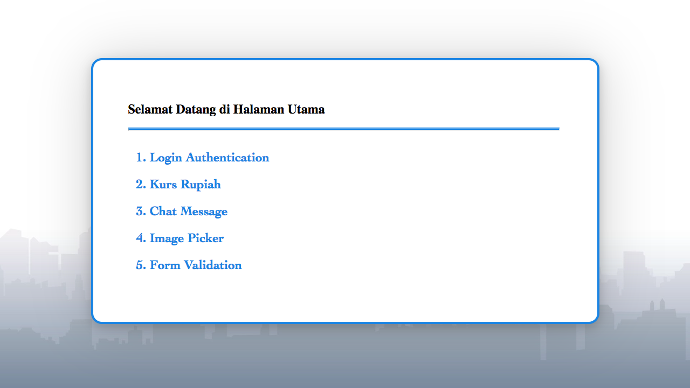
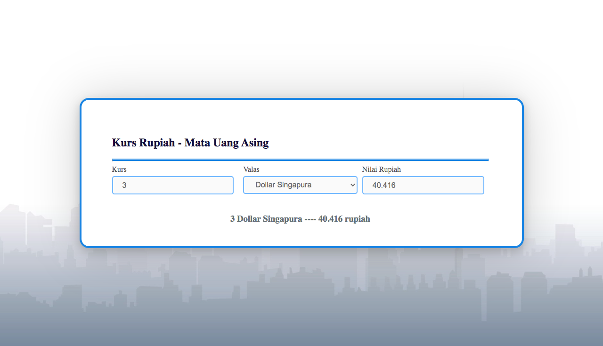
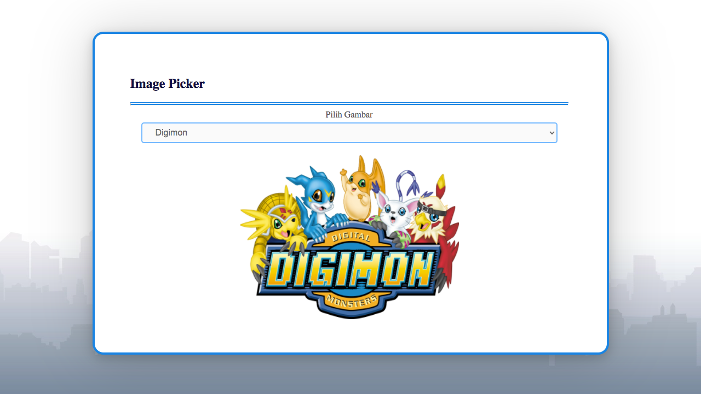
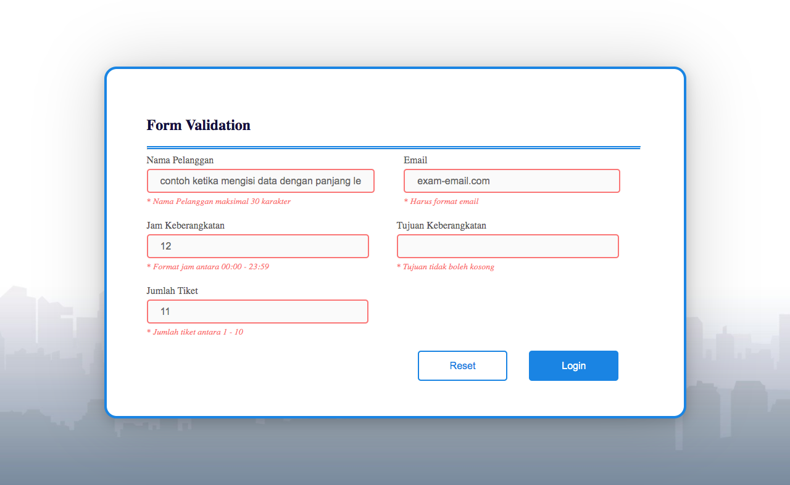

# Web Programming - JavaScript Praktikum 

STT Terpadu Nurul Fikri\
Web Programming - JavaScript Praktikum

## Information

```bash
Nama   : Evry Nazyli Ciptanto
NIM    : 0110220045
Prodi  : Teknik Informatika - TI08
```

## Directory Tree Structure
```
.
├── README.md
├── assets
│   ├── bg.jpg
│   ├── ss
│   │   ├── ss-1.png
│   │   ├── ss-2.png
│   │   ├── ss-3.png
│   │   ├── ss-4.png
│   │   ├── ss-5.png
│   │   └── ss.png
│   └── style.css
├── chat
│   ├── assets
│   │   ├── bg-chat.png
│   │   ├── script.js
│   │   └── style.css
│   └── index.html
├── formvalidation
│   ├── assets
│   │   ├── script.js
│   │   └── style.css
│   └── index.html
├── imagepicker
│   ├── assets
│   │   ├── TomandJerry.png
│   │   ├── digimon.png
│   │   ├── doraemon.png
│   │   ├── pokemon.png
│   │   ├── script.js
│   │   ├── shinchan.png
│   │   ├── sonic-the-hedgehog.png
│   │   └── style.css
│   └── index.html
├── index.html
├── kurs
│   ├── assets
│   │   ├── script.js
│   │   └── style.css
│   └── index.html
└── login
    ├── assets
    │   ├── script.js
    │   └── style.css
    ├── dashboard.html
    └── index.html
```

## Screenshots
#### Home


#### Login Authentication


#### Kurs Rupiah


#### Chat Message


#### Image Picker


#### Form Validation

